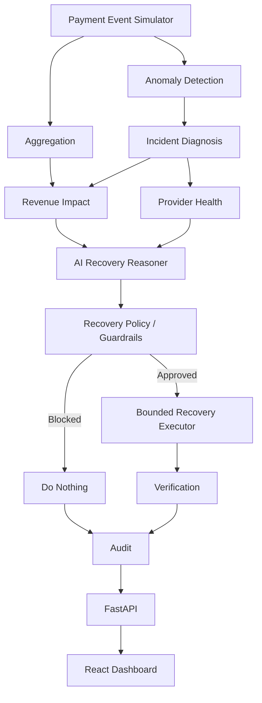

# 🍉 Payment Recovery Intelligence

> **An AI revenue recovery agent that detects payment degradation, diagnoses the source, chooses a bounded recovery action, and measures the money recovered.**

[](https://razorpay.com/buildathon/)
[](https://fastapi.tiangolo.com/)
[](https://vite.dev/)
[](https://ai.google.dev/)

---

## ✦ What is this?

Payment failures are not always isolated transaction problems.

A provider can degrade.  
A bank can become unstable.  
Timeouts can spike.  
A small failure-rate change can translate into a large amount of revenue at risk.

**Payment Recovery Intelligence** closes the loop:

```text
Detect
  ↓
Diagnose
  ↓
Assess Revenue Impact
  ↓
AI Recovery Decision
  ↓
Deterministic Guardrails
  ↓
Bounded Recovery
  ↓
Verify Money Recovered
  ↓
Audit
```

Instead of stopping at *"payments are failing"*, the system asks:

> **What is going wrong, how much revenue is at risk, what is the safest available recovery action, and did it actually recover money?**

---

## 🎯 Built for the AI Revenue Recovery track

This project was built for the **AI Revenue Recovery** track of the Razorpay AI Buildathon.

The goal of the track is to build an agent that can:

- detect revenue at risk
- determine the right intervention
- execute a bounded recovery workflow
- show measured money recovered
- enforce stopping rules / guardrails
- maintain an audit trail

This project focuses on the specific workflow:

**Payment degradation → root-cause diagnosis → recovery decision → bounded recovery → verification**

---

# 🧭 Quick Navigation

- [The Problem](#-the-problem)
- [The Product](#-the-product)
- [How It Works](#-how-it-works)
- [AI Decision Layer](#-ai-decision-layer)
- [Safety & Guardrails](#-safety--guardrails)
- [Dashboard](#-dashboard)
- [Demo Scenarios](#-demo-scenarios)
- [Architecture](#-architecture)
- [Project Structure](#-project-structure)
- [Tech Stack](#-tech-stack)
- [Run Locally](#-run-locally)
- [Example Outcome](#-example-outcome)
- [Design Decisions](#-design-decisions)
- [Limitations](#-limitations)
- [Future Work](#-future-work)

---

# 🔴 The Problem

A payment system can lose revenue without the merchant immediately knowing **why**.

Consider a provider that normally processes payments successfully, but suddenly begins returning errors.

A simple monitoring dashboard can tell a merchant:

> Failure rate increased.

But a recovery system needs to go further:

1. **Detect** the abnormal behaviour.
2. **Diagnose** the most likely source.
3. **Quantify** the revenue at risk.
4. **Evaluate** available recovery options.
5. **Choose** an action using AI reasoning.
6. **Constrain** that action with deterministic policy.
7. **Execute** only a bounded batch.
8. **Verify** how much value was recovered.
9. **Record** the complete decision trail.

That is the loop this project demonstrates.

---

# 🍉 The Product

## Recovery Command Center

The dashboard is designed around the **recovery loop**, rather than around a collection of disconnected charts.

The main screen shows:

### Incident

What went wrong?

- incident type
- affected provider / bank / cohort
- failure-rate spike
- baseline failure rate
- failed transactions
- revenue at risk

### Decision

What should happen next?

- AI recommended strategy
- recommended provider when relevant
- reasoning
- confidence
- operational risk

### Guardrail

Should the proposed action actually be allowed?

The AI does **not** directly execute payment actions.

A deterministic policy layer validates:

- whether the strategy is allowed
- whether AI confidence is high enough
- whether a fallback provider exists
- whether the fallback is healthier than the degraded provider
- whether the action is compatible with the diagnosed incident

### Recovery

How much can safely be attempted?

Recovery is deliberately bounded by a maximum retry batch.

### Verification

Did it work?

The system reports:

- attempted recoveries
- recovered transactions
- recovered amount
- recovery rate

### Audit

What happened, and why?

The final audit record captures:

- incident
- affected dimension
- AI decision
- approved action
- recovery outcome

---

# ⚙️ How It Works

## 01 — Detect

The system analyzes synthetic payment events across multiple dimensions:

- provider
- bank
- payment method
- geography
- failure reason
- time windows

It compares observed failure behaviour against historical/baseline behaviour to surface abnormal spikes.

### Example

```text
Provider Z

Baseline failure rate     7.7%
Incident failure rate    32.6%
Relative increase         4.2×
Failed transactions         106
Failed payment value    ₹5.67L
```

---

## 02 — Diagnose

Detection tells us that something changed.

Diagnosis attempts to determine **what changed**.

The system combines:

- dimension-level anomalies
- time-window anomalies
- failure-reason anomalies

Examples:

```text
provider_degradation
bank_degradation
timeout_spike
payment_method_degradation
geographic_degradation
```

The diagnostic layer deliberately does not use the synthetic scenario label as its input. The scenario is used only to generate the underlying payment behaviour.

---

## 03 — Assess Impact

Once an incident is diagnosed, the system identifies the affected transactions and calculates:

```text
Affected transactions
Failed transactions
Failed payment value
```

This converts an operational anomaly into a business impact:

> **How much revenue is currently at risk?**

---

## 04 — AI Recovery Decision

The AI reasoner receives structured evidence rather than the entire payment stream.

Example evidence:

```text
Incident:
Provider Z degradation

Failure rate:
32.6%

Baseline:
7.7%

Failed payment value:
₹5.67L

Available providers:
Provider X
Provider Y

Recovery options:
- retry_with_fallback_provider
- retry_after_delay
- recommend_alternate_method
- do_nothing
```

The model must choose only from the available recovery actions.

It returns a structured recommendation containing:

```json
{
  "recommended_strategy": "retry_with_fallback_provider",
  "recommended_provider": "provider_y",
  "reasoning": "...",
  "confidence": 0.95,
  "risk": "low",
  "expected_recovery": "..."
}
```

### Important design principle

**AI recommends. Deterministic code decides whether the recommendation is allowed.**

This keeps the LLM out of the final safety boundary.

---

# 🛡️ Safety & Guardrails

Financial workflows should not give an LLM unrestricted authority.

The recovery policy layer therefore acts as a deterministic gate between reasoning and execution:

```text
          AI Recommendation
                  │
                  ▼
        ┌──────────────────┐
        │ Recovery Policy  │
        │    Guardrails    │
        └────────┬─────────┘
                 │
          approved / blocked
                 │
                 ▼
          Recovery Executor
```

The policy checks include:

### Allowed action

A strategy must be valid for the diagnosed incident type.

### Confidence threshold

Recommendations below the configured confidence threshold are blocked.

### Provider health

A fallback provider cannot be:

- unavailable
- the degraded provider
- less healthy than the degraded provider

### Bounded execution

Recovery attempts are capped by a maximum batch size.

This prevents an incorrect recommendation from turning into an unbounded retry loop.

---

# 🖥️ Dashboard

The dashboard is intentionally built as a **command center**.

It provides a single navigation path:

```text
Incident
   ↓
Impact
   ↓
AI Decision
   ↓
Guardrail
   ↓
Recovery
   ↓
Verification
   ↓
Audit
```

### Interactive elements

The pipeline stages can be selected to inspect different parts of the recovery process.

The dashboard also includes a **Replay Recovery** interaction.

Replay does not execute another recovery.

It visually walks through the already-computed decision:

```text
Detect
  → Diagnose
  → Decide
  → Guardrail
  → Recover
  → Verify
```

At the verification stage, the recovered amount is animated to make the complete recovery loop easy to understand during a demo.

---

# 🧪 Demo Scenarios

The simulator currently supports three controlled scenarios.

| Scenario | Simulated degradation | Typical recovery |
|---|---|---|
| `provider_degradation` | One payment provider becomes unhealthy | Retry with a healthier fallback |
| `bank_degradation` | A bank experiences elevated technical failures | Retry after delay |
| `timeout_spike` | Payment timeouts increase across the stream | Retry after delay |

The generator creates reproducible synthetic payment traffic so that the same scenario can be demonstrated consistently.

---

# 🏗️ Architecture



## Core principle

The system separates **reasoning** from **execution**.

```text
Deterministic evidence
        ↓
      AI
   reasoning
        ↓
Deterministic policy
        ↓
Bounded execution
        ↓
Verification
```

This makes the system easier to inspect, test, and extend into a real payment integration.

---

# 📁 Project Structure

```text
payment-recovery-intelligence/
│
├── docs/
│   └── architecture.md
│
├── notes/
│   └── first_attempt.md
│
├── src/
│   ├── aggregate.py
│   ├── detector.py
│   ├── diagnosis.py
│   ├── generator.py
│   ├── impact.py
│   ├── main.py
│   ├── models.py
│   ├── provider_health.py
│   ├── recover.py
│   ├── recovery_policy.py
│   └── ai_reasoner.py
│
├── frontend/
│   ├── src/
│   ├── components/
│   ├── App.jsx
│   ├── App.css
│   └── vite.config.js
│
├── README.md
└── .gitignore
```

### Backend responsibilities

| File | Responsibility |
|---|---|
| `generator.py` | Generates reproducible synthetic payment events |
| `aggregate.py` | Computes overall payment metrics |
| `detector.py` | Detects temporal, dimensional and failure-reason anomalies |
| `diagnosis.py` | Converts anomalies into an incident diagnosis |
| `impact.py` | Quantifies affected transactions and payment value |
| `provider_health.py` | Calculates observed provider health |
| `ai_reasoner.py` | Produces the structured AI recovery recommendation |
| `recovery_policy.py` | Deterministically validates the recommendation |
| `recover.py` | Selects, executes and verifies bounded recovery |
| `main.py` | Orchestrates the complete recovery loop |
| `models.py` | Defines payment event data structures |

---

# 🧰 Tech Stack

## Backend

- **Python**
- **FastAPI**
- deterministic anomaly detection
- synthetic payment-event simulation

## AI

- **Google Gemini**
- structured JSON output
- evidence-constrained recovery reasoning

## Frontend

- **React**
- **Vite**
- **Tailwind CSS**
- **shadcn/ui**
- custom CSS for the command-center interface

## Architecture

- REST API
- Vite development proxy
- deterministic policy / guardrail layer
- bounded recovery execution
- verification + audit trail

---

# 🚀 Run Locally

## 1. Clone the repository

```bash
git clone https://github.com/drishya22/payment-recovery-intelligence.git
cd payment-recovery-intelligence
```

---

## 2. Backend setup

Create and activate a virtual environment:

### Windows

```bash
python -m venv .venv
.venv\Scripts\activate
```

### macOS / Linux

```bash
python3 -m venv .venv
source .venv/bin/activate
```

Install dependencies:

```bash
pip install -r requirements.txt
```

Set the Gemini API key:

### Windows PowerShell

```powershell
$env:GEMINI_API_KEY="YOUR_API_KEY"
```

### macOS / Linux

```bash
export GEMINI_API_KEY="YOUR_API_KEY"
```

Start FastAPI:

```bash
uvicorn app:app --reload --port 8000
```

---

## 3. Frontend setup

Open another terminal:

```bash
cd frontend
npm install
npm run dev
```

Then open the Vite URL shown in the terminal.

The frontend uses the `/api` path and Vite proxies requests to the local FastAPI server.

---

# 🎬 Suggested Demo Flow

For the fastest demonstration:

### 1. Start with the command center

Show the incident summary:

> **Provider Z degradation — ₹5.67L at risk**

### 2. Walk through the pipeline

Click:

```text
Detect → Diagnose → Decide → Guardrail → Recover → Verify
```

### 3. Show the AI decision

Highlight:

- fallback provider
- reasoning
- confidence
- risk

### 4. Show the guardrail

Explain:

> The LLM proposes the action. Deterministic policy decides whether it is allowed.

### 5. Hit **Replay recovery**

Let the interface animate the complete decision path.

### 6. End on verification

Show:

```text
₹4.68L recovered
90% recovery rate
100 bounded attempts
```

### 7. Finish with the audit trail

The final question should be:

> **Can we explain what happened, what the agent decided, what was allowed, and what money was recovered?**

The answer should be visible on the screen.

---

# 📊 Example Outcome

A representative provider-degradation run can produce an outcome like:

```text
INCIDENT
Provider Z degradation

BASELINE FAILURE RATE
7.7%

INCIDENT FAILURE RATE
32.6%

FAILURE SPIKE
4.2×

FAILED TRANSACTIONS
106

REVENUE AT RISK
₹5.67L

AI DECISION
Retry with fallback provider

FALLBACK
Provider Y

AI CONFIDENCE
95%

RISK
Low

BOUNDED RECOVERY
100 attempts

RECOVERED
90 transactions

RECOVERED VALUE
₹4.68L

RECOVERY RATE
90%
```

> **These figures come from the project's synthetic payment simulation. They are not live Razorpay transaction data.**

---

# 🧠 Design Decisions

## Why synthetic payment data?

The project is designed as a buildathon prototype and does not use real merchant payment data.

Synthetic events make it possible to:

- reproduce incidents
- control failure patterns
- test multiple degradation scenarios
- demonstrate the complete recovery loop
- avoid exposing real financial information

---

## Why use AI for the decision?

The deterministic system is good at answering:

> **What happened?**

The recovery reasoner is useful for answering:

> **Given the evidence and available actions, which intervention makes the most sense?**

This separation gives the AI a meaningful role without making the entire system dependent on an LLM.

---

## Why not let the LLM execute actions directly?

Because payment recovery is a financial workflow.

The project deliberately places deterministic policy between the model and execution.

That provides a clear boundary:

```text
LLM
↓
Recommendation

Policy
↓
Permission

Executor
↓
Action

Verifier
↓
Outcome
```

---

## Why bounded recovery?

A recovery system should not retry indefinitely.

The prototype therefore limits the number of transactions selected for recovery.

This creates an explicit stopping rule and makes the recovery outcome measurable.

---

# ⚠️ Limitations

This is a **buildathon prototype**, not a production payment-recovery system.

### Current limitations

- payment traffic is synthetic
- recovery execution is simulated
- no real payment provider is contacted
- no real merchant credentials are used
- provider health is calculated from the generated event stream
- the AI decision depends on Gemini availability
- the current policy engine is intentionally simple
- recovery verification is based on the simulator rather than a live payment confirmation

These boundaries are intentional for the prototype.

---

# 🔭 Future Work

A production version could extend the same architecture with:

### Real payment signals

Consume:

- payment events
- webhooks
- provider health signals
- failure codes
- settlement / reconciliation information

### Smarter diagnosis

Add:

- statistical change-point detection
- cohort-level causal analysis
- adaptive baselines
- anomaly ranking by financial impact

### Better recovery planning

Add:

- provider-specific retry policies
- payment-method-aware routing
- customer communication strategies
- dynamic retry timing
- recovery cost / benefit estimation

### Stronger verification

Close the loop using actual payment outcomes:

```text
Recovery attempt
      ↓
Payment event / webhook
      ↓
Confirmed recovery
      ↓
Actual money recovered
```

### Production-grade controls

Add:

- idempotency
- rate limits
- approval workflows
- action-level permissions
- stronger audit storage
- rollback / compensation workflows
- observability and alerting

---

# 🧩 The Core Idea

Payment recovery should not be:

> **Detect → Dashboard → Human figures it out**

It can become:

> **Detect → Diagnose → Reason → Guardrail → Recover → Verify**

The important part is not simply adding an LLM to a payment dashboard.

The important part is building a **bounded decision loop** where AI reasoning is connected to measurable business outcomes.

---

## Built with ❤️ for the Razorpay AI Buildathon

**Track:** AI Revenue Recovery  
**Focus:** Payment degradation → root cause → bounded recovery  
**Architecture:** AI reasoning + deterministic guardrails + measurable recovery

**Repository:** `github.com/drishya22/payment-recovery-intelligence`

---

### 📌 Buildathon references

- [Razorpay AI Buildathon](https://razorpay.com/buildathon/)
- [Razorpay](https://razorpay.com/)
